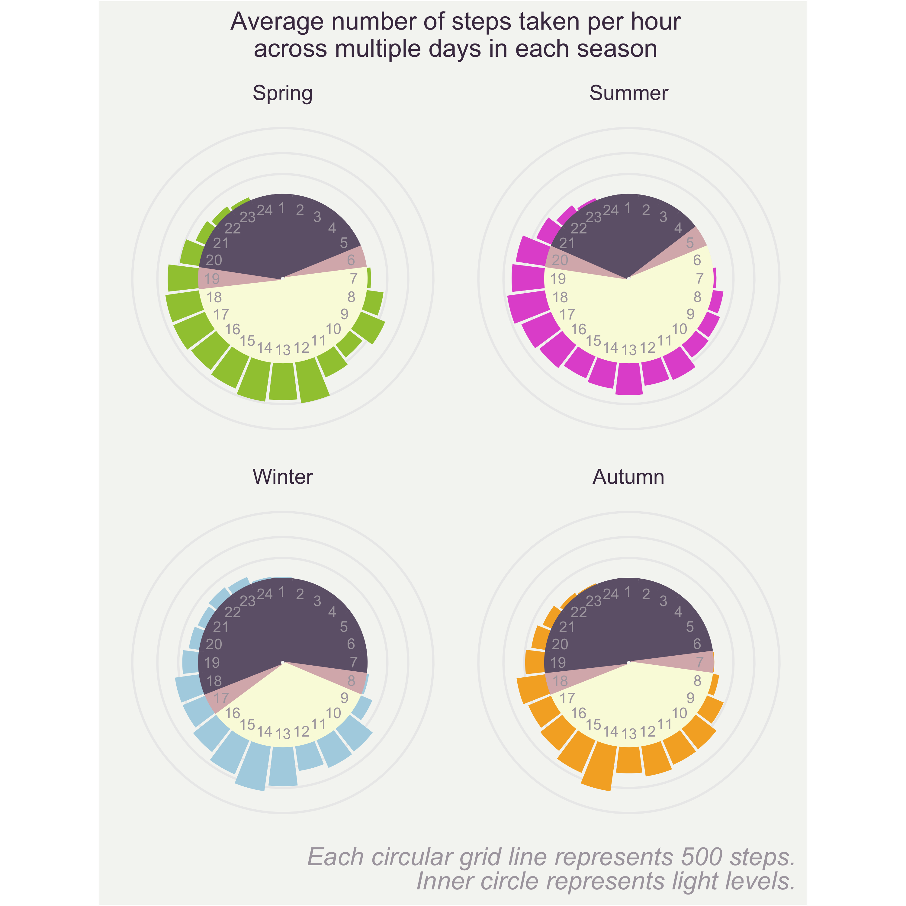

# Exploring my FitBit data

## Aims
Wanted to analyse my data from my fitbit watch to practice some different data visualisation techniques.
Had an idea to look at how the number of steps I do varies from the time of day and season. eg. Am I less active in winter vs summer, or at certain times of day?

## Considerations:
* Data collected are bias to when I wear my fitbit, I don't always wear it everyday or at all times in the day. eg. swimming or when it's charging
* Discovered for the steps data the data is not collected every minute, there are variations with sometimes gaps of a few minutes even though presumably I'm wearing it most of the time. Though most data points were collected every minute.

## Rough sketch of idea

## Plot so far:

Also in [Plots/](Plots/) with code in [Scripts/exploreStepsData.R](Scripts/exploreStepsData.R)

* Plan to add data on sunrise and sunset to center of plot and colour by day/night time.
